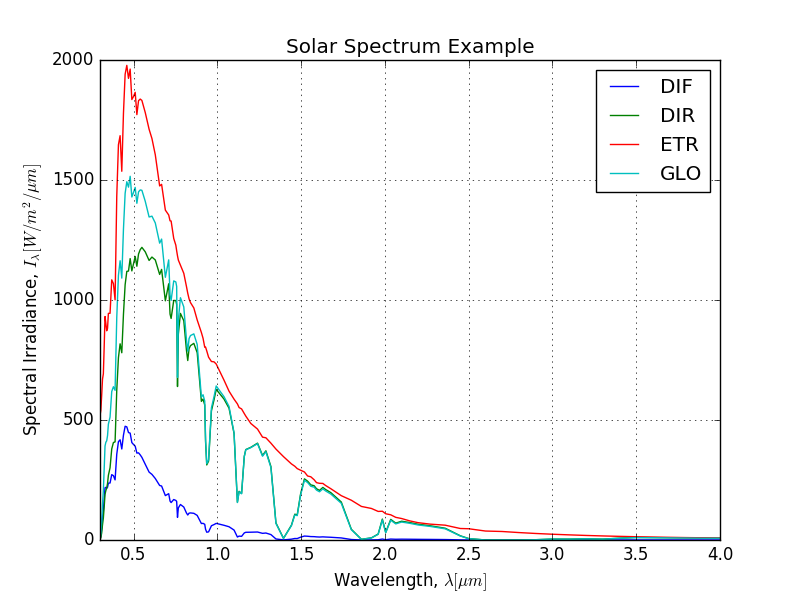

.. SolarUtils documentation master file, created by
   sphinx-quickstart on Mon Jul 11 10:26:17 2016.
   You can adapt this file completely to your liking, but it should at least
   contain the root `toctree` directive.

Welcome to SolarUtils's documentation!
======================================
**Version** |version| (|release|)

.. include:: ../../README.rst

.. include:: ../../CHANGES.rst

.. toctree::
   :maxdepth: 2

   core
   exceptions

Indices and tables
==================

* :ref:`genindex`
* :ref:`modindex`
* :ref:`search`
